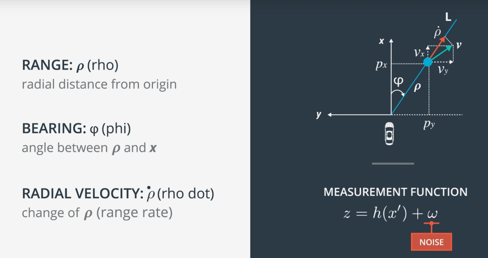

# Extended Kalman Filter 

In this project I have utilized an Extended kalman filter algorithm to estimate the state of a moving object of interest with noisy lidar and radar measurements. The main goal of the project is to apply Extended Kalman Filter to fuse data from LIDAR and Radar sensors of a self driving car using C++.

## Contents of this Repository

* `src` - Directory for project source code
   * `main.cpp` - Entry point for the Extended Kalman Filter reads in data, calls a function to run the Kalman filter, calls a function                   to calculate RMSE.
   * `FusionEKF.cpp` - Initializes the filter, calls the predict function, calls the update function.
   * `kalman_filter.cpp` - Defines the predict function, the update function for lidar, and the update function for radar.
   * `tools.cpp` - Contains code to calculate RMSE and Jacobian Matrix
* `data` - Contains one input file with provided by Udactity and one output file generated by the program
* `Docs` - Directory with files formats description

## Dependencies & Environment

* cmake >= 3.5
 * All OSes: [click here for installation instructions](https://cmake.org/install/)
* make >= 4.1
  * Linux: make is installed by default on most Linux distros
  * Mac: [install Xcode command line tools to get make](https://developer.apple.com/xcode/features/)
  * Windows: [Click here for installation instructions](http://gnuwin32.sourceforge.net/packages/make.htm)
* gcc/g++ >= 5.4
  * Linux: gcc / g++ is installed by default on most Linux distros
  * Mac: same deal as make - [install Xcode command line tools]((https://developer.apple.com/xcode/features/)
  * Windows: recommend using [MinGW](http://www.mingw.org/)
* [Eigen library](src/Eigen)

## How to run the code

1. Clone this repo.
2. Make a build directory: `mkdir build && cd build`
3. Compile: `cmake .. && make` 
   * On windows, you may need to run: `cmake .. -G "Unix Makefiles" && make`
4. Run it by either of the following commands: 
   * `./ExtendedKF`

## Brief summary about LIDAR

LIDAR stands for Light Detection And Ranging. Uses infrared Laser beam to detect the distance between sensor and nearby object. Rotating swivels scans the field of view. Lasers are pulsed and the pulses are reflected by objects. These reflections produce the point cloud that represent these objects. LIDAR will produce 3D measurement px,py,pz. But for the case of driving on the road, we could simplify the pose of the tracked object as: px,py,and one rotation. In other words, we could only use px and px to indicate the position of 
the object, and one rotation to indicate the orientation of the object. But in real world where you have very steep road, 
you have to consider z axis as well. Also in application like airplane and drone, you definitely want to consider pz as well.

## Brief summary about RADAR

RADAR stands for Radio Detection and Ranging. Radar uses doppler effect (Change in frequency of Radio waves) to measure velocity. Radars can also be used for localization. They can be used to detect objects without direct line on sight like underneath the buildings, vehicles that are obscured. They are least effected by rain or fog and can have a wide field of view about 150 degrees and can range upto 200 meters. LIDAR measurements are in cartesian co-ordinate system whereas RADAR measurements are in polar co-ordinate system.

## Kalman filter general steps and data flow

All Kalman filters have three steps 

1. Initialization
2. Prediction
3. Update

Here is the pictorial representation of data flow in Kalman filter

   
## Mathematical equations involved in Kalman filter and Extended Kalman filter

* _x_ is the mean state vector.
* _F_ is the stae transition matrix.
* _u_ is the external motion vector.
* _P_ is the state covariance matrix, indicating the uncertainty of the object's state.
* _Q_ is the process covariance matrix.
* _H_ is the measurement matrix.
* _z_ is the measurement.
* _R_ is the measurement noise.
* _I_ is the identity matrix.
* _K_ is the Kalman filter gain.
* _Hj_ and _Fj_ are the jacobian matrix.

A standard Kalman filter can only handle linear equations. Both the Extended Kalman Filter (EKF) and the Unscented Kalman Filter (UKF) allows you to use non-linear equations. The difference between EKF and UKF is how they handle non-linear equations. Extended Kalman Filter uses the Jacobian matrix to linearize non-linear functions. Unscented Kalman Filter on the other hand, does not need to linearize non-linear functions, instead the unscented Kalman filter takes representative points from a Gaussian distribution.

# Results

The results were visualized with [Sensor Fusion utilities](https://github.com/udacity/CarND-Mercedes-SF-Utilities).

## Visualisation

The following graph compares real and estimated values for car coordinates using data provided by Udacity

## RMSE

The accuracy requirement is that the algortihm should perform with RMSE error lower than some threshold values. This shown in table below:

| Parameter | RMSE | RMSE threshold |
|:---------:|:----:|:--------------:|
|x          |0.0973| 0.11           |
|y          |0.0854| 0.11           |
|Vx         |0.4512| 0.52           |
|Vy         |0.4399| 0.52           |

## Observations

I have run the EKF program by selectively turning off LIDAR and RADAR measurements and I have observed the following results.

1. RADAR measurements are tend to be more more noisy than the LIDAR measurements.
2. Extended Kalman Filter tracking by utilizing both measurements from both LIDAR and RADAR can reduce the noise/errors from the sensor measurements, and provide the robust estimations of the tracked object locations.
